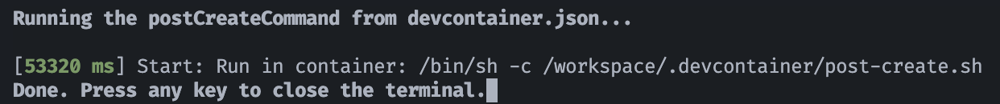
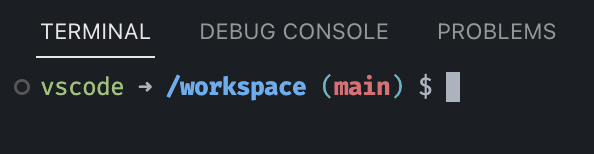
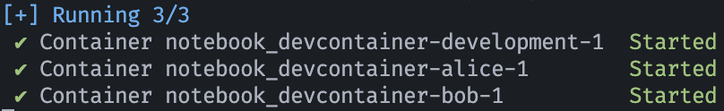

# Notebook

- [ ] Essential API tracing (OpenTelemetry)
  - [ ] Tracing
  - [ ] Static code analysis
- [ ] Data flow tracking
  - [ ] Tracing
  - [ ] Static code analysis
- [ ] MPC code transformation
  - [ ] Tagged Notebook cell & implicit remote function
  - [ ] Async/implicit evaluation
- [ ] Linting & type-checking
  - [ ] Impure functions
- [ ] Errors & diagnostics
- [ ] Status API: Ray, SecretFlow, SPU
- [ ] Type stubs: SecretFlow, SPU, HEU
- [ ] Unified configuration (Pydantic)
  - [ ] Pydantic-Protobuf interop
  - [ ] Endpoint Projection (choreographic)

## 本地开发

`pnpm run bootstrap`

## 使用 Dev Container

### 初次启动

1. 确保安装了 [Dev Containers][dev-containers-plugin] 插件（插件市场搜索 `ms-vscode-remote.remote-containers`）
2. 在 VS Code 中打开本项目
3. 打开命令面板（macOS 快捷键 `command-shift-P`），搜索 `Reopen in Container`，执行命令
4. 等待容器创建完毕

[dev-containers-plugin]: https://marketplace.visualstudio.com/items?itemName=ms-vscode-remote.remote-containers

当终端出现如下关于 `postCreateCommand ...` 之内容，开发容器即创建完毕：

### 使用开发容器

启动成功后，VS Code 会显示项目根目录的内容。创建的容器包含了开发需要的必要命令。

运行 `pnpm run bootstrap` 来安装依赖。

运行 `pnpm run lint && pnpm run test` 来运行 CI 检查，来验证开发容器是否正常工作。

在容器中，对工作空间的修改会立即同步到宿主机，反之亦然。

如果要关闭开发容器并在本地重新打开工作空间，运行 `Reopen Folder Locally` 命令。开发容器会被停止。

### 额外节点与 Jupyter Lab

开发容器会创建 3 个节点 `development` `alice` `bob`，其中 VS Code 默认连接到 `development` 节点。

`alice` `bob` 使用 SecretFlow 镜像，预置 `secretflow` 和 `jupyterlab`。要打开 Jupyter Lab，在开发容器启动成功后：

- <http://localhost:8090/lab> — `alice`
- <http://localhost:8092/lab> — `bob`

### 理解开发容器

官方文档：<https://code.visualstudio.com/docs/devcontainers/containers>

关键配置文件：

- [`.devcontainer.json`][devcontainer-conf]
- [`docker-compose.yml`](./.devcontainer/docker-compose.yml)

本地工作空间通过 [Docker bind mount][bind-mount] 的方式挂载到容器中的 `/workspace` 目录下，因此，容器中的 `/workspace` 目录即为本地工作空间的内容。

文件系统的其余部分都处在容器内，对它们的变更不会同步到宿主机，但在容器停止后，这些变更会被保留，直到容器被删除。这也意味着所有的命令行工具都在容器中运行，而不是宿主机。

容器中仅部分 VS Code 插件可用（比如主题和快捷键），同时，开发容器的配置文件 [`.devcontainer/devcontainer.json`][devcontainer-conf] 中也指定了一些插件，这些插件会在容器创建时自动安装。

一般情况下，开发容器仅创建一次。退出容器后，再次打开工作空间时，VS Code 会自动启动并连接到已经创建好的容器。如果需要重新创建容器，可以运行 `Rebuild and Reopen in Container` 命令。

开发容器基于 Docker Compose，因此容器间通信使用的是 Docker Compose 的[网络][compose-networking]。容器间的通信使用容器名作为主机名，比如要在 `alice` 容器中访问 `bob` 容器的 `8092` 端口，可以使用 `bob:8092`，如果该端口提供 HTTP 服务，则 URL 即是 `http://bob:8092`。

[devcontainer-conf]: ./.devcontainer/devcontainer.json
[bind-mount]: https://docs.docker.com/storage/bind-mounts/
[compose-networking]: https://docs.docker.com/compose/networking/

## 已知问题及排查

### 初次启动时间停滞在 `Started` 状态

如果开发容器启动时长时间停留在上图所示的状态，可能需要断开链接再重新尝试：执行命令 `Close Remote Connection`。具体原因未知。
