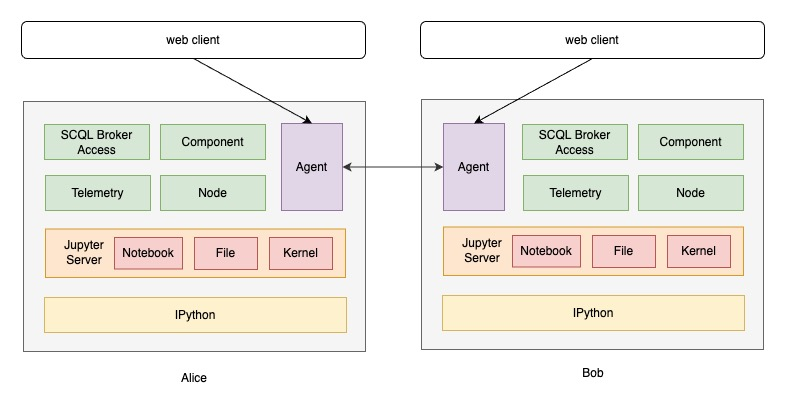

## 介绍

secretnote 是专为隐语开发者打造的高级工具套件。以 notebook 的形式呈现，支持多节点代码执行和文件管理，同时提供运行状态追踪功能，极大地提升开发者的效率和工作体验。

<p align="center"></p>

## 使用

### 与 secretflow 一起使用

#### pip 安装方式

secretnote 提供单独的 python 包，可以通过 pip 安装。下面介绍如何在两台机器上使用 secretnote 创建 secretflow 运行环境。

1. 分别在两台机器上安装 secretflow 和 secretnote。（python 环境需求：>=3.8, <3.12）

```bash
pip install -U secretflow
pip install -U secretnote
```

2. 在任意一台机器上启动 secretnote 服务。

```bash
secretnote
```

3. 在浏览器中打开步骤 2 启动服务的 web client，默认地址为 `http://ip:8888`，并按照新手引导页面熟悉 secretnote 的基本操作。

#### docker 安装方式

secretnote 也提供 docker 镜像，可以通过 docker 安装。下面介绍如何在一台机器上使用 secretnote 创建两个 secretflow 运行环境。

1. 启动两个容器

```bash
docker run -it -p 8090:8888 -e "SELF_PARTY=alice" secretflow/secretnote:unstable-amd64
docker run -it -p 8092:8888 -e "SELF_PARTY=bob" secretflow/secretnote:unstable-amd64
```

也可以使用 docker compose:

```yml
services:
  alice:
    image: 'secretflow/secretnote:unstable-amd64'
    platform: linux/amd64
    environment:
      - SELF_PARTY=alice
      - ALL_PARTIES=alice,bob
    ports:
      - 8090:8888
    entrypoint: /root/scripts/start.sh
    volumes:
      - /root/scripts

  bob:
    image: 'secretflow/secretnote:unstable-amd64'
    platform: linux/amd64
    environment:
      - SELF_PARTY=bob
      - ALL_PARTIES=alice,bob
    ports:
      - 8092:8888
    entrypoint: /root/scripts/start.sh
    volumes:
      - /root/scripts
```

2. 在浏览器中打开 http://127.0.0.1:8090，并按照新手引导页面熟悉 secretnote 的基本操作。

### 与 SCQL 一起使用

secretnote 通过对 p2p scql 进行产品化封装，可以通过 web client 降低开发者编写 scql query 以及配置 ccl 的难度。下面介绍使用方式：

1. 分别在两台机器上部署 scql 环境，参考 [P2P 模式部署](https://www.secretflow.org.cn/docs/scql/0.5.0b2/zh-Hans/topics/deployment/how-to-deploy-p2p-cluster)。

2. 分别在两台机器上安装 secretnote，并启动服务。

```bash
pip install -U secretnote
```

```bash
# party 为 scql broker 服务的 party_code
# host 为 scql broker 服务的地址
secretnote -mode=scql --party=alice --host=http://127.0.0.1:8991
```

3. 在浏览器中打开步骤 2 启动服务的 web client，默认地址为 `http://ip:8888`，并按照新手引导页面熟悉 secretnote 的基本操作。
