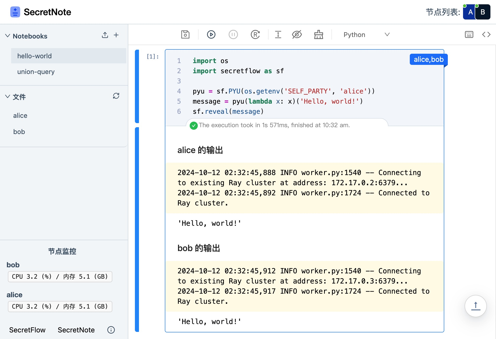

<h1 align="center">SecretNote</h1>

SecretNote 是为 SecretFlow (隐语) 学习者和开发者定制的高级工具套件，可帮助您快速开展隐语实验。它包括 SecretNote SF 和 SecretNote SCQL，均以 Notebook 的形式呈现。前者用于 Python 下的 [SecretFlow](https://www.secretflow.org.cn/zh-CN/docs/secretflow) 运行，支持多节点代码执行和文件管理；后者用于进行 [SCQL](https://www.secretflow.org.cn/zh-CN/docs/scql) 相关实验。

<p align="center">
  
</p>

\* _SecretNote 的设计是为了学习和原型实验，请勿在生产环境中直接使用。_

## 快速开始

### 隐语实训平台云 SecretNote (推荐)

SecretNote SF 现在隐语实训平台提供云端版本，开箱即用，无需环境配置直接拉起计算节点，欢迎 [立即体验](https://www.secret-flow.com/secretnote)。

### 本地启动 SecretNote SF

- 安装 SecretNote Python 包

  ```sh
  pip install secretnote
  ```

- 根据需要拉起若干个计算节点

  [secretflow/secretnote](https://hub.docker.com/r/secretflow/secretnote) 提供了内置 SecretFlow 的、版本号相互对应的计算节点镜像。推荐使用 Docker Compose 拉起计算节点以便相互通信。SecretNote 提供了常用的拉起两个计算节点的 [docker-compose.yml](./docker/secretnote-sf-sim/docker-compose.yml)，可根据需要调整监听端口、镜像版本等配置

  ```sh
  cd docker/secretnote-sf-sim && docker compose up -d
  ```

- 启动 SecretNote SF，在右上角添加计算节点，即可开始实验

  ```sh
  secretnote <work_dir> # 等价于 secretnote sf <work_dir>
  ```

  使用上述配置的节点地址为 `127.0.0.1:8090` 和 `127.0.0.1:8092`。在代码中，节点间可通过 service 名相互访问；镜像使用 8888 作为 Notebook 服务端口，6379 作为 Ray 端口，8000 作为 SecretFlow 集群网络端口，8001 作为 SPU 端口

- 如有需要，请查看更完整的具体[示例](docs/SECRETFLOW-INTRO.md)

### 本地启动 SecretNote SCQL

SecretNote SCQL 提供了 P2P SCQL 的产品化封装，降低了开发者配置 CCL 和编写 Query 的难度。

- 安装 SecretNote Python 包

  ```sh
  pip install secretnote
  ```

- 使用 [P2P 方式](https://www.secretflow.org.cn/zh-CN/docs/scql/main/topics/deployment/how-to-deploy-p2p-cluster) 拉起 SCQL 环境，参考 [scql/examples/p2p-tutorial](https://github.com/secretflow/scql/tree/main/examples/p2p-tutorial)，下载该文件夹，执行

  ```sh
  bash setup.sh && docker compose up -d
  ```

  可根据需要调整 SCQL Broker 服务的端口

- 分别作为 Alice 方和 Bob 方启动 SecretNote，即可开始实验

  ```sh
  secretnote scql <work_dir> --party=alice --broker=http://127.0.0.1:8991
  secretnote scql <work_dir> --party=bob --broker=http://127.0.0.1:8992
  ```

- 如有需要，请查看更完整的具体[示例](docs/SCQL-INTRO.md)

## 高级

### 配置覆盖

命令行下 SecretNote 可以接受可传递给 Jupyter Notebook 的参数，具体可参考 [开发配置文件](pyprojects/secretnote/secretnote/sf/.jupyter/config_dev.py)：

```sh
secretnote sf . --config=./secretnote/secretnote/sf/.jupyter/config_dev.py --no-browser
```

### 清理残留的计算节点记录

SecretNote 默认会在 `~/.jupyter` 下存储计算节点的相关信息。如果遇到计算节点状态识别异常，可尝试手工清理：

```sh
rm ~/.jupyter/secretnote*
```

### 本地构建 SecretFlow 计算节点镜像

[secretflow/secretnote](https://hub.docker.com/r/secretflow/secretnote) 目前维护 1.7.0b0 至 1.10.0b0 的镜像，同时支持 amd64 和 arm64 架构。如有定制化的需求，可自行构建计算节点镜像，例如构建 1.9.0b0 (linux/arm64) 镜像的命令如下：

```sh
docker buildx build --build-arg SECRETFLOW_VERSION=1.9.0b0 --platform linux/arm64 -t secretflow/secretnote:1.9.0b0 -f ./docker/secretflow-secretnote/Dockerfile .
```

## 开发与贡献

SecretNote 的前端基于 [Mana](https://github.com/difizen/mana) 和 [Libro](https://github.com/difizen/libro) 开发，开源后端基于 [Jupyter Server](https://github.com/jupyter-server/jupyter_server) 开发。

```sh
pnpm bootstrap && pnpm build # 安装依赖并初次构建
```

以开发 SecretNote SF 为例，需同时启动组件编译、Playground DevServer、本地 Jupyter Server：

```sh
pnpm run dev # 在 packages/secretnote-sf 下监视组件修改
pnpm run dev # 在 packages/secretnote-sf-site 下启动 DevServer
NODE_ENV=development python -m secretnote sf <work_dir> --config=./secretnote/sf/.jupyter/config_dev.py --no-browser
# 在 pyprojects 下启动 Jupyter Server
```

请根据需要调整 Playground DevServer 的代理配置。如需 HMR 能力，请暂时从 `../../../secretnote-sf` 引入组件。进一步了解项目结构和 API 约定可查看 [CONTRIBUTING](CONTRIBUTING.md)。

## 问题与反馈

请在 [Issues](https://github.com/secretflow/secretnote/issues) 反馈，或点击 [隐语实训平台](https://www.secret-flow.com/welcome) 右上角 “反馈” 按钮加群咨询。
