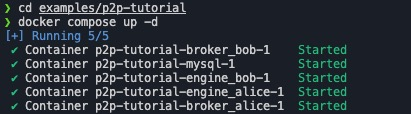
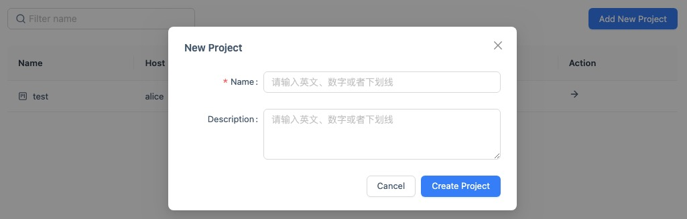
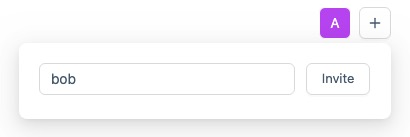
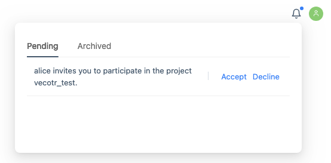
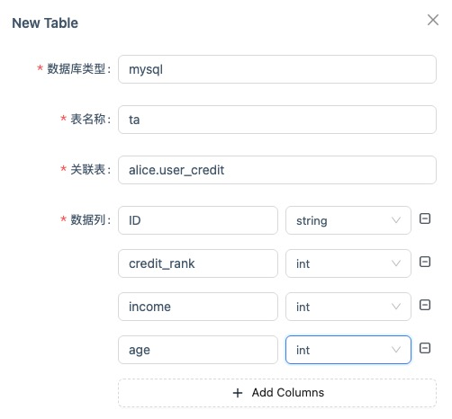
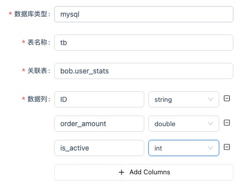
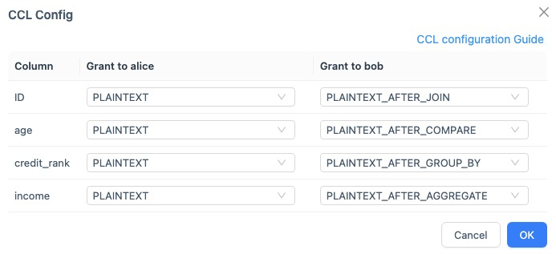
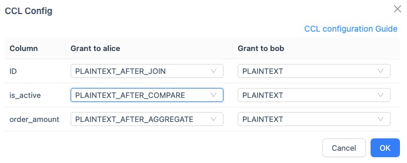
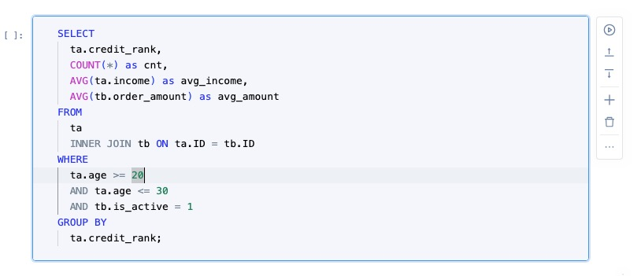

下面演示在一台机器上使用 SCQL + SecretNote 来模拟不同参与方完成一次 SCQL Query。

### 准备环境

使用 docker 以 P2P 模式部署 SCQL 系统，可以参考[官网文档](https://www.secretflow.org.cn/zh-CN/docs/scql/0.5.0b2/topics/deployment/how-to-deploy-p2p-cluster)。简单起见，我们直接使用 [scql p2p examples](https://github.com/secretflow/scql/tree/main/examples/p2p-tutorial)。



然后在本地安装 SecretNote。

```shell
pip install -U secretnote
```

**注意：当前 pip 包只支持 python>=3.8,<=3.10 版本**

打开两个终端，分别执行下面的启动命令：

```shell
# 打开 alice web client
secretnote --mode=scql --host=http://127.0.0.1:8991 --party=alice
# 打开 bob web client
secretnote --mode=scql --host=http://127.0.0.1:8992 --party=bob
```

### 创建项目

alice 新建项目。



进入项目，在页面右上角成员区域邀请 bob 加入项目。



此时，在 bob 主页会收到邀请信息。点击同意按钮。



此时，alice 和 bob 都可以看到刚才创建的项目。

### 创建数据表

alice 和 bob 分别在自己的项目中创建数据表。





### 授权 CCL

alice 和 bob 分别在数据表中选择刚才创建的数据表，右键菜单中点击配置 CCL。

alice:



bob:



### 执行 SCQL Query

alice 新建 notebook，在代码区域输入 SQL 查询语句，输出区域会输出查询结果。


