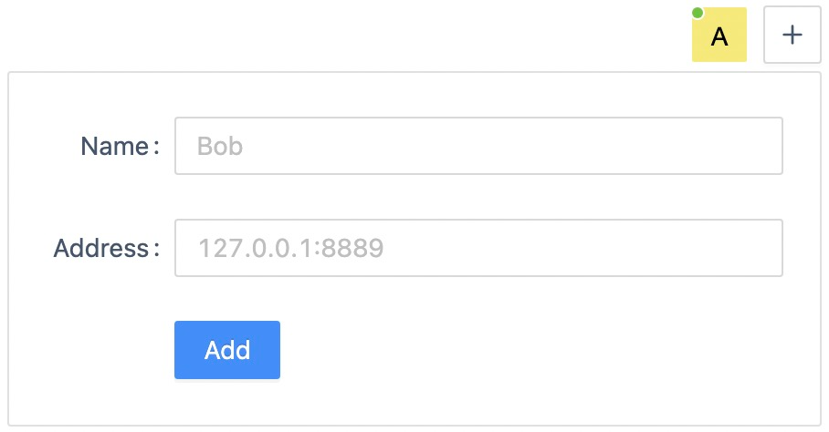
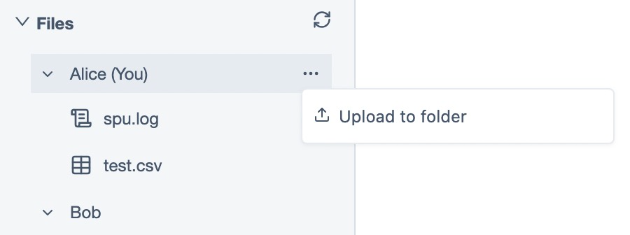
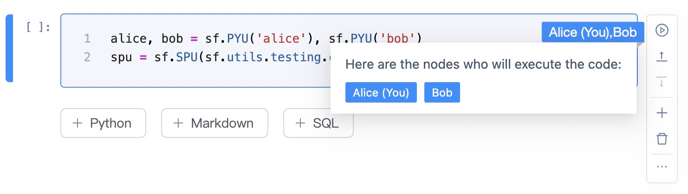
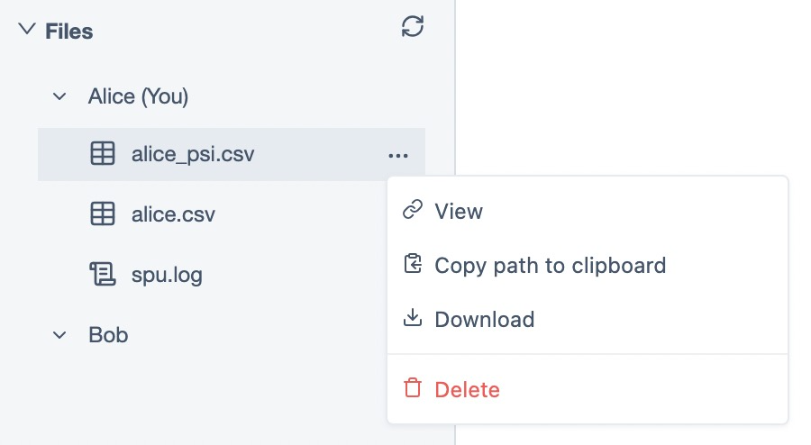

# 完成一次 PSI

下面演示在一台机器上使用 docker 启动两个容器环境来模拟不同参与方完成一次 PSI。

### 准备环境

在一台机器上使用 docker compose 启动两个容器，容器启动时会安装 SecretFlow、SecretNote，并且分别启动 Ray 服务以及 SecretNote 服务。

在一个文件夹下面新建文件夹 alice 和 bob， 新建文件 `docker-compose.yml`，内容如下：

```yml
services:
  alice:
    image: 'secretflow/secretnote:1.6.1'
    platform: linux/amd64
    environment:
      - SELF_PARTY=alice
      - ALL_PARTIES=alice,bob
    ports:
      - 8090:8888
    volumes:
      - ./alice:/root/workspace

  bob:
    image: 'secretflow/secretnote:1.6.1'
    platform: linux/amd64
    environment:
      - SELF_PARTY=bob
      - ALL_PARTIES=alice,bob
    ports:
      - 8092:8888
    volumes:
      - ./bob:/root/workspace
```

然后在新建的文件夹中执行以下命令：

```bash
docker compose up -d
```

在浏览器中（推荐使用 Chrome）通过地址 `http://127.0.0.1:8090` 打开 Web Client，并在右上角节点管理区域将两个计算节点添加进来（因为 docker compose 内置 DNS 解析功能，允许节点之间通过服务名称互相访问，所以两个计算节点地址可以填 `alice:8888` 和 `bob:8888`）。



### 准备数据

我们需要一个数据集来构建垂直分区的场景。可以点击下面的两个链接下载数据集。

[iris_alice.csv](./data/iris_alice.csv)

[iris_bob.csv](./data/iris_bob.csv)

下载后分别上传到两个节点上。



### 运行 Notebook

我们继续点击下面的链接下载一份示例代码，然后导入到 Notebook 列表中。

[psi.ipynb](./data/psi.ipynb)

Notebook 的操作方式和 Jupyter Notebook 一致，并且在此基础上做了许多针对性的功能优化，比如 Python 单元格可以选择多个节点同时去执行，然后将执行结果汇总起来输出。这给隐语多控制器执行的开发模式带来了较大的便利。



### 验证结果

完成执行后，刷新文件列表，会看到新生成的隐私求交结果文件，右键打开文件详情就可以校验结果。


